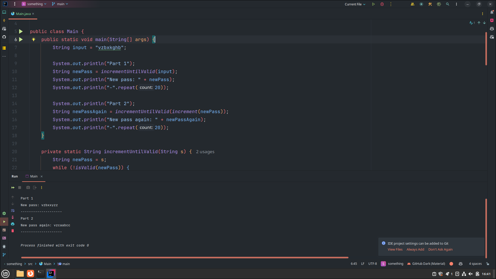
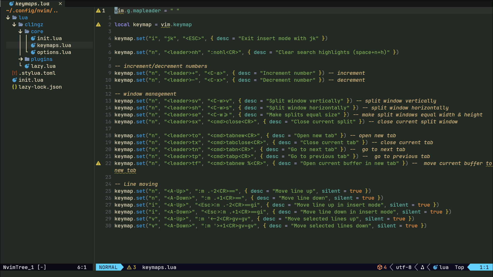
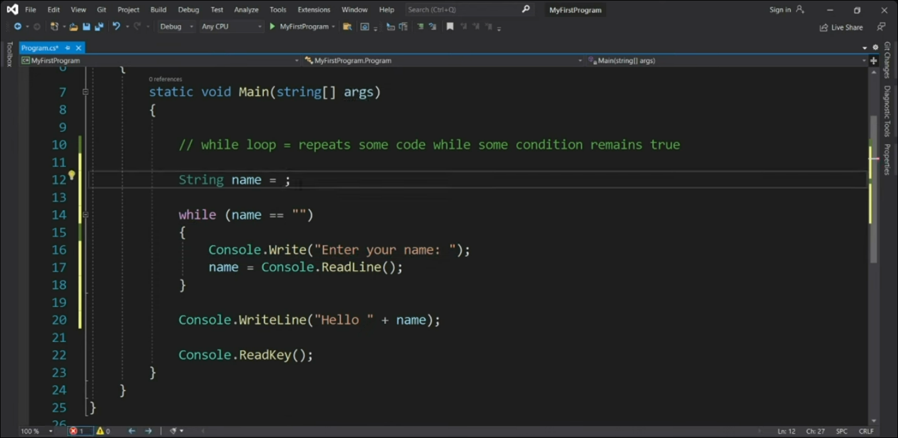
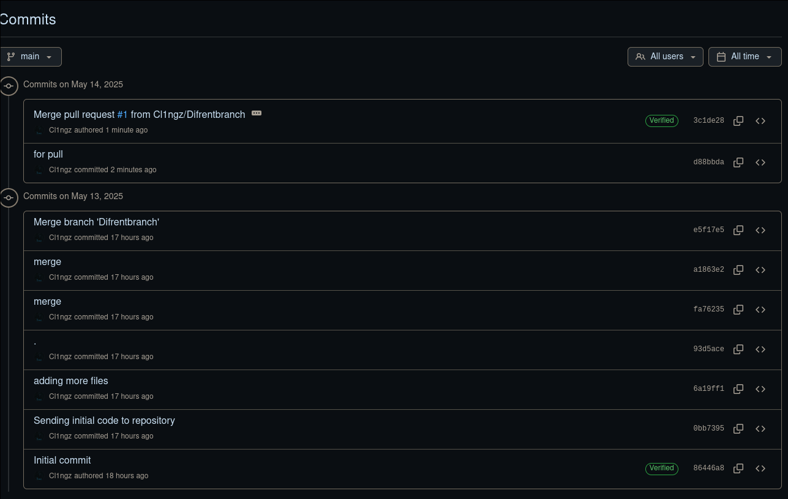
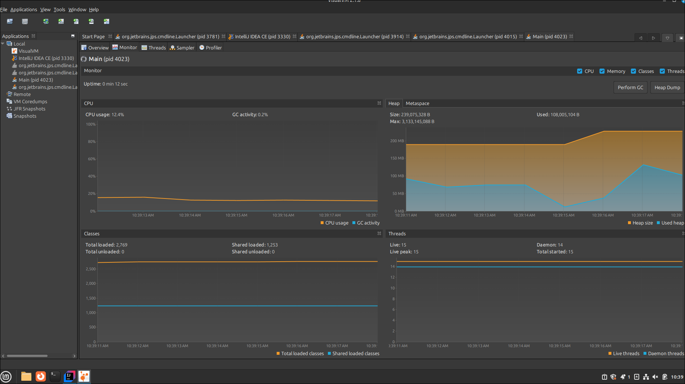
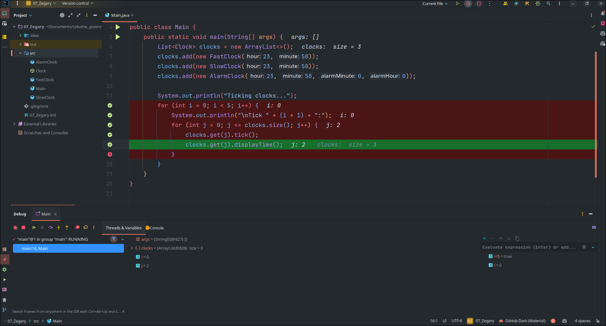

# NPTO

# 1. Zapoznanie z edytorami

# 2. Zapoznanie z gitem

# 3. Zapoznanie z profilowaniem

# 4. Zapoznanie z debugowaniem

po zdebugowaniu zauważyłem że trzeba zmienić znak `<=` na `<`

# 5. Zapoznanie z docerem
