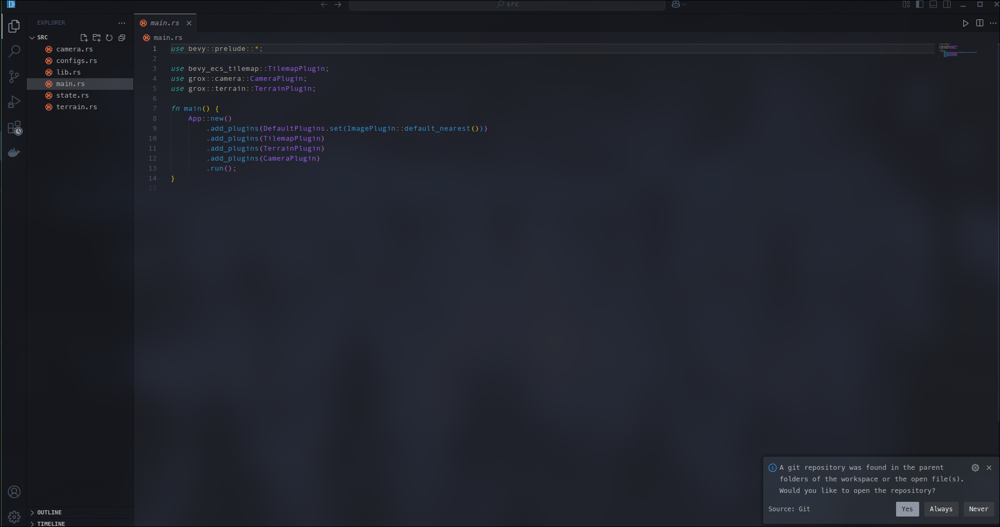
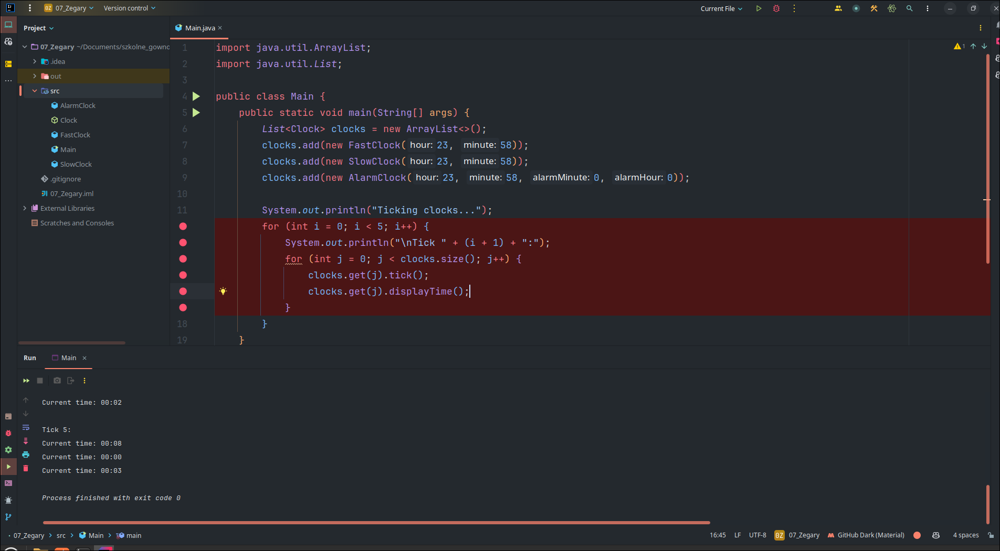

# NPTO

# 1. Zapoznanie z edytorami

Wykonano ćwiczenia w różnych edytorach kodu. Na poniższych zrzutach ekranu widoczne są różne edytory, w których pracowałem:

# 2. Zapoznanie z gitem

Utworzono lokalne repozytorium Git, wykonano serię commitów prezentujących zmiany w kodzie. Kod przesłano na githuba oraz wykonano pull requesta. Historii commitów możea zobaczyć na poniższym zrzucie ekranu:

# 3. Profilowanie aplikacji

Przeprowadzono profilowanie zużycia pamięci i czasu wykonywania metod aplikacji. Na poniższym zrzucie ekranu widoczny jest wynik analizy:

# 4. Zapoznanie z debugowaniem

Uruchomiono aplikację w trybie debugowania, ustawiono punkt przerwania i prześledzono wykonanie programu.

Podczas analizy kodu zauważono błąd w warunku pętli: znak <= powodował nieoczekiwane zachowanie. Po zmianie na < poprawiono logikę działania:
po zdebugowaniu zauważyłem że trzeba zmienić znak `<=` na `<`

# 5. Zapoznanie z docerem

Zapoznałem się z dockerem i stworzyłem kontener z aplikacją w języku Java. A następnie ją uruchomiłem.

przesłałem dockerfile na githuba

po czym przesłałem go na dockerhub

